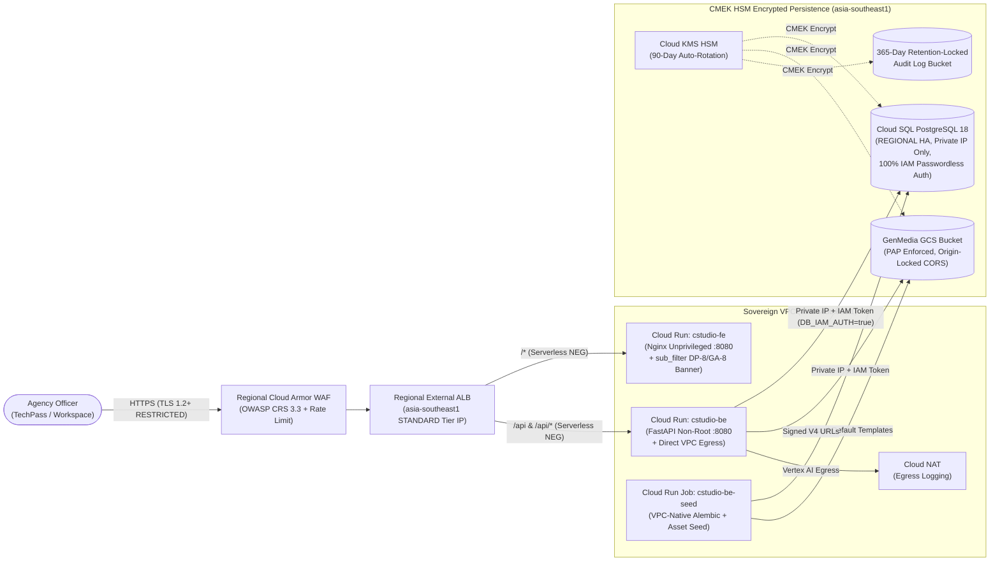

# Creative Studio — Singapore Government IM8 Overlay (Pattern A)

> [!IMPORTANT]
> **`./bootstrap-im8.sh` is a standalone replacement for `./bootstrap.sh`.**
> Do **not** run `./bootstrap.sh` before or after `./bootstrap-im8.sh`. Upstream `./bootstrap.sh` provisions global Firebase Hosting, Public-IP Cloud SQL, and static database passwords, which violate IM8 `DP-1`, `NS-1`, and `IAM-4`.

---

## 1. Architecture Overview (Pattern A)

All ingress, compute, storage, cryptography, and database traffic are pinned strictly to **`asia-southeast1` (Singapore)** using an **Additive Overlay Pattern** so `git merge upstream/main` remains conflict-free.



---

## 2. Deployment Guide

### Prerequisites
1. **GCP Project** inside your GCC 2.0 agency compartment with billing linked.
2. **OAuth 2.0 Web Client ID** created in [Google Cloud Console → APIs & Services → Credentials](https://console.cloud.google.com/apis/credentials) (`Web application` type).
3. Local CLI tools installed: `gcloud`, `terraform` ($\ge 1.5$), `openssl`, and `jq`.

### Run the IM8 Bootstrap
From the repository root on the `im8` branch:

```bash
./bootstrap-im8.sh
```

`./bootstrap-im8.sh` executes 6 automated steps:
1. **Prerequisite Check**: Validates `gcloud`, `terraform`, `openssl`, and `jq`.
2. **Parameter Prompt**: Prompts for `GCP_PROJECT_ID`, optional `CUSTOM_DOMAIN` (e.g., `cstudio.agency.gov.sg`), `OAUTH_CLIENT_ID`, `ALLOWED_ORGS` (default `tech.gov.sg`), and `ADMIN_USER_EMAIL`.
3. **API Enablement**: Enables Cloud KMS, Compute, Service Networking, Cloud SQL, Cloud Run, Artifact Registry, Secret Manager, Cloud Build, Vertex AI, Cloud Workflows, and Sensitive Data Protection (`dlp`).
4. **Regional Secrets & ALB TLS Cert**: Stores `GOOGLE_CLIENT_ID` and `GOOGLE_TOKEN_AUDIENCE` in Secret Manager (`user-managed` replication in `asia-southeast1`) and generates a regional TLS certificate in `infra/environments/im8-prod/.certs/` (replace `alb.crt`/`alb.key` with your agency CA cert for custom FQDNs).
5. **Terraform Provisioning**: Creates a sovereign GCS state bucket (`<project>-cstudio-im8-tfstate`) and applies `infra/environments/im8-prod`.
6. **Container Build & VPC-Native Database Seeding**:
   - Builds `backend/Dockerfile.im8` and deploys `cstudio-be`.
   - Updates and runs the **`cstudio-be-seed` Cloud Run Job** (`python -m bootstrap.bootstrap`) inside the VPC over Private IP using passwordless IAM authentication to apply Alembic migrations and seed the default workspace, admin user, VTO assets, and media templates.
   - Builds `frontend/Dockerfile.im8` (`nginx.im8.conf`) and deploys `cstudio-fe`.

### Post-Deployment Step (OAuth Origin Registration)
Copy the **`Regional ALB Origin`** printed at the end of `./bootstrap-im8.sh` (e.g., `https://<ALB_IP>` or `https://cstudio.agency.gov.sg`) and add it to **Authorized JavaScript origins** in your OAuth 2.0 Web Client in [APIs & Services → Credentials](https://console.cloud.google.com/apis/credentials).

---

## 3. IM8 Control & Overlay File Matrix

| IM8 Control ID | Requirement | Overlay Implementation |
| :--- | :--- | :--- |
| **`DP-1` / `NS-1` / `NS-5`** | Singapore data & ingress residency; no global Anycast termination | `cstudio-fe` on Cloud Run (`asia-southeast1`) + Regional External ALB (`EXTERNAL_MANAGED`, `STANDARD` tier IP) in `infra/modules/im8-network-alb/main.tf` |
| **`AS-1` / `AS-9` / `DSS`** | Regional WAF (OWASP CRS 3.3) & browser security headers | Regional Cloud Armor (`sqli/xss/rce/lfi-v33-stable` + rate limit) + HSTS/CSP/`X-Frame-Options: DENY` in `frontend/nginx.im8.conf` |
| **`DP-8` / `GA-8`** | Classification ceiling (`RESTRICTED / SENSITIVE NORMAL`) & AI verification notice | Zero-touch HTML injection via Nginx `sub_filter '</body>'` in `frontend/nginx.im8.conf` (0 edits to `frontend/src/**`) |
| **`IAM-4` / `NS-1` / `DP-3`** | Passwordless DB auth over Private VPC IP with enforced TLS | `DB_IAM_AUTH=true` & `DB_IP_TYPE=PRIVATE` in `backend/src/database.py` and `backend/alembic/env.py`; `CLOUD_IAM_SERVICE_ACCOUNT` user & `ipv4_enabled=false` in `infra/environments/im8-prod/main.tf` |
| **`CK-1..3` / `DP-2`** | FIPS 140-3 Level 3 HSM CMEK with 90-day rotation | `sql_cmek`, `storage_cmek`, and `artifact_cmek` in `infra/modules/im8-kms-logging/main.tf` |
| **`LM-1..4` / `LM-12`** | `DATA_READ`/`DATA_WRITE` audit logs, 5s VPC Flow Logs, 365-day locked sink | `google_project_iam_audit_config` + retention-locked GCS audit bucket + optional WOG GSOC Pub/Sub sink in `infra/modules/im8-kms-logging/main.tf` |
| **`BR-1` / `ST-1` / `AS-8`** | Regional HA DB + PITR backups; bucket PAP enforced & origin-locked CORS | `availability_type = "REGIONAL"`, 30-day PITR backups, `public_access_prevention = "enforced"`, and `cors.origin = [local.alb_origin]` in `infra/environments/im8-prod/main.tf` |
| **`CS-4`** | Non-privileged container runtime | `USER 101` in `frontend/Dockerfile.im8` (`nginx-unprivileged`) and `USER 10001:10001` in `backend/Dockerfile.im8` |

---

## 4. Pulling Upstream Updates

Because all IM8 additions live in side-by-side `.im8` files and `infra/{modules/im8-*,environments/im8-prod}` (with only a backward-compatible 2-flag addition in `backend/src/database.py` and `backend/alembic/env.py`), pulling new upstream releases requires no manual conflict resolution in `frontend/` or `infra/`:

```bash
git fetch upstream
git checkout im8
git merge upstream/main
```

After merging upstream updates, redeploy the containers (and re-run migrations/seeding if schema changed):

```bash
./bootstrap-im8.sh
```
